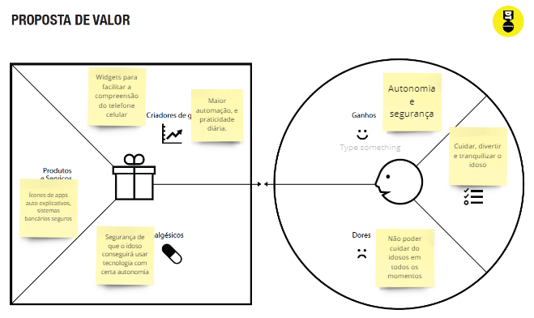

# Informações do Projeto
`TÍTULO DO PROJETO`  

HELP.ME

`CURSO` 

CIÊNCIAS DA COMPUTAÇÃO

## Participantes

> Os membros do grupo são: 
> 
> - Rafael Ganascini de Moura
> - Diego Pereira Maia
> - Tomás
> - Erivaldo Gelson da Rocha João
> - Eduardo Assumpcao Spinelli

# Estrutura do Documento

- [Informações do Projeto](#informações-do-projeto)
  - [Participantes](#participantes)
- [Estrutura do Documento](#estrutura-do-documento)
- [Introdução](#introdução)
  - [Problema](#problema)
  - [Objetivos](#objetivos)
  - [Justificativa](#justificativa)
  - [Público-Alvo](#público-alvo)
- [Especificações do Projeto](#especificações-do-projeto)
  - [Personas, Empatia e Proposta de Valor](#personas-empatia-e-proposta-de-valor)
  - [Histórias de Usuários](#histórias-de-usuários)
  - [Requisitos](#requisitos)
    - [Requisitos Funcionais](#requisitos-funcionais)
    - [Requisitos não Funcionais](#requisitos-não-funcionais)
  - [Restrições](#restrições)
- [Projeto de Interface](#projeto-de-interface)
  - [User Flow](#user-flow)
  - [Wireframes](#wireframes)
- [Metodologia](#metodologia)
  - [Divisão de Papéis](#divisão-de-papéis)
  - [Ferramentas](#ferramentas)
  - [Controle de Versão](#controle-de-versão)
- [**############## SPRINT 1 ACABA AQUI #############**](#-sprint-1-acaba-aqui-)
- [Projeto da Solução](#projeto-da-solução)
  - [Tecnologias Utilizadas](#tecnologias-utilizadas)
  - [Arquitetura da solução](#arquitetura-da-solução)
- [Avaliação da Aplicação](#avaliação-da-aplicação)
  - [Plano de Testes](#plano-de-testes)
  - [Ferramentas de Testes (Opcional)](#ferramentas-de-testes-opcional)
  - [Registros de Testes](#registros-de-testes)
- [Referências](#referências)

# Introdução

## Problema

Na sociedade atual e com o grande avanço na tecnologia, está cada vez mais difícil de se atualizar quanto as novidades e as funcionalidades novas de cada produto. Com isso surge uma grande quantidade de pessoas (em sua maioria idosos) que acreditam que essas tais tecnologias novas sejam "difíceis demais" de lidar e acabam optando por produtos mais simples com menos funcionalidades. Entretanto, com o tempo, essas pessoas vão ficando cada vez mais longes da informação, já que nossa maior fonte nos dias atuais são nossos telefones e computadores.

## Objetivos

Nossos objetivos com a nossa aplicação são de diminuir a complexidade da interface do dispositivo móvel para que fique mais acessível para pessoas tecnologicamente alanfabetas e adicionar funcionalidades como alarmes, lembretes e contatos de emergência a tela inicial, proporcionando ao usuário uma experiência mais prática.

## Justificativa

O que motivou a realização deste trabalho foi a experiência pessoal de cada membro do grupo, onde foi vista a dificuldade de idosos em sua prórpia família, onde os membros mais velhos apresentaram dificuldade em realizar tarefas simples nos dispositivos móveis. Para isso, será feito um widget de de acessibilidade para estes mesmos, baseado nas entrevistas realizadas no processo de Design Thinking

## Público-Alvo

Nosso público alvo serão, principalemnte, os idosos, porém, outros grupos como familiares e médicos podem também ser considerados, já que existe a chance de o idoso não conseguir instalar o widget a partir do tema normal do seu celular.

# Especificações do Projeto

......  COLOQUE AQUI O SEU TEXTO ......

> Apresente uma visão geral do que será abordado nesta parte do
> documento, enumerando as técnicas e/ou ferramentas utilizadas para
> realizar a especificações do projeto

## Personas, Empatia e Proposta de Valor

> **IDOSO**
> 
> 
> 
>
> **Proposta de Valor**
> 
> 

> **MÉDICO**
> 
> 
> 
>
> **Proposta de Valor**
> 
> 

> **CUIDADOR**
> 
> 
> 
>
> **Proposta de Valor**
> 
> 

## Histórias de Usuários

Com base na análise das personas forma identificadas as seguintes histórias de usuários:

|EU COMO... `PERSONA`| QUERO/PRECISO ... `FUNCIONALIDADE` |PARA ... `MOTIVO/VALOR`                 |
|--------------------|------------------------------------|----------------------------------------|
|IDOSO               | Registrar minhas tarefas, fazer ligações e tomar meus remédios          | Não esquecer de fazê-las               |
|MÉDICO              | Preescrever remédios               | Cuidar melhor dos meus pacientes       |
|CUIDADOR            | Cuidar do Idoso                    | Deixá-lo feliz e confortável           |

## Requisitos

### Requisitos Funcionais

|ID    | Descrição do Requisito  | Prioridade |
|------|-----------------------------------------|----|
|RF-001| Permitir que o usuário cadastre tarefas | ALTA | 
|RF-002| Permitir que o usuário adicione lembretes | ALTA |
|RF-003| Permitir que o usuário adicione contator na tela inicial | ALTA |
|RF-004| Aumentar o tamanho dos botões | MÉDIA |
|RF-005| Ajustar ícones para deixá-los auto explicativos | MÉDIA |

### Requisitos não Funcionais

|ID     | Descrição do Requisito  |Prioridade |
|-------|-------------------------|----|
|RNF-001| Os widgets devem aparecer na tela inicial | ALTA | 
|RNF-002| Os widgets devem ser responsivos e atualizados em tempo real no caso de horários | MÉDIA | 
|RNF-003| As notícias devem ser atualizadas a cada 5 minutos | BAIXA |

## Restrições

O projeto está restrito pelos itens apresentados na tabela a seguir.

|ID| Restrição                                             |
|--|-------------------------------------------------------|
|01| O app só poderá ser acessado em aparelhos móveis      |

# Projeto de Interface

O app terá uma tela inicial simples, onde a partir dela o usuário deve adicionar várias funcionalidades ao seu app, tornando-o personalizável de acordo com preferências e necessidades. Dentre estas funcionalidades teremos os requisitos funcionais mencionados anteriormente.

## User Flow

> 

## Wireframes

......  INCLUA AQUI OS WIREFRAMES DAS TELAS DA APLICAÇÃO COM UM BREVE DESCRITIVO ......

> Wireframes são protótipos das telas da aplicação usados em design de interface para sugerir a
> estrutura de um site web e seu relacionamentos entre suas
> páginas. Um wireframe web é uma ilustração semelhante ao
> layout de elementos fundamentais na interface.
> 
> **Links Úteis**:
> - [Ferramentas de Wireframes](https://rockcontent.com/blog/wireframes/)
> - [Figma](https://www.figma.com/)
> - [Adobe XD](https://www.adobe.com/br/products/xd.html#scroll)
> - [MarvelApp](https://marvelapp.com/developers/documentation/tutorials/)
> 
> **Exemplo**:
> 
> 

# Metodologia

A metodologia utilizada foi o processo de design thinking, onde primeiramente foi realizada a matriz de alinhamento CSD e o mapa de stakeholders. A matriz foi realizada para que futuramente pesquisemos mais afundo sobre nossas dúvidas, suposições e certezas sobre o assunto. O mapa de stakeholders foi feito para vizualizar melhor o público alvo do projeto. Após isso foi realizada uma entrevista qualitativa para saber melhor quais pontos deveriam ser abordados e quais funcionalidades deveriam ser implementadas. A última tarefa realizada foi a de criação de personas e propostas de valor apra cada uma, onde foi possível definir com mais clareza as funcionalidades que serão implementadas no produto final.

## Divisão de Papéis

> - Powerpoint: Rafael Ganascini de Moura
> - Relatório: Diego Pereira Maia
> - Wireframe e Userflow: Erivaldo Gelson da Rocha João
> - Apreesentação: Tomaz e Eduardo Assumpcao Spinelli

Todas as etapas do processo de design thinking foram feitas por todo o grupo em conjunto.

## Ferramentas

| Ambiente  | Plataforma              |Link de Acesso |
|-----------|-------------------------|---------------|
|Processo de Design Thinkgin  | Miro | https://miro.com/app/board/uXjVMYDaO0I=/ | 
|Repositório de código | GitHub | https://github.com/ICEI-PUC-Minas-PPLCC-TI/ti-1-ppl-cc-m-20231-tecnologia_e_informacao | 
|Protótipo Interativo | MavelApp ou Figma | https://figma.com/XXXXXXX | 

## Controle de Versão

......  COLOQUE AQUI O SEU TEXTO ......

> Discuta como a configuração do projeto foi feita na ferramenta de
> versionamento escolhida. Exponha como a gerência de tags, merges,
> commits e branchs é realizada. Discuta como a gerência de issues foi
> realizada.
> A ferramenta de controle de versão adotada no projeto foi o
> [Git](https://git-scm.com/), sendo que o [Github](https://github.com)
> foi utilizado para hospedagem do repositório `upstream`.
> 
> O projeto segue a seguinte convenção para o nome de branchs:
> 
> - `master`: versão estável já testada do software
> - `unstable`: versão já testada do software, porém instável
> - `testing`: versão em testes do software
> - `dev`: versão de desenvolvimento do software
> 
> Quanto à gerência de issues, o projeto adota a seguinte convenção para
> etiquetas:
> 
> - `bugfix`: uma funcionalidade encontra-se com problemas
> - `enhancement`: uma funcionalidade precisa ser melhorada
> - `feature`: uma nova funcionalidade precisa ser introduzida
>
> **Links Úteis**:
> - [Tutorial GitHub](https://guides.github.com/activities/hello-world/)
> - [Git e Github](https://www.youtube.com/playlist?list=PLHz_AreHm4dm7ZULPAmadvNhH6vk9oNZA)
> - [5 Git Workflows & Branching Strategy to deliver better code](https://zepel.io/blog/5-git-workflows-to-improve-development/)
>
> **Exemplo - GitHub Feature Branch Workflow**:
>
> 

# **############## SPRINT 1 ACABA AQUI #############**

# Projeto da Solução

......  COLOQUE AQUI O SEU TEXTO ......

## Tecnologias Utilizadas

......  COLOQUE AQUI O SEU TEXTO ......

> Descreva aqui qual(is) tecnologias você vai usar para resolver o seu
> problema, ou seja, implementar a sua solução. Liste todas as
> tecnologias envolvidas, linguagens a serem utilizadas, serviços web,
> frameworks, bibliotecas, IDEs de desenvolvimento, e ferramentas.
> Apresente também uma figura explicando como as tecnologias estão
> relacionadas ou como uma interação do usuário com o sistema vai ser
> conduzida, por onde ela passa até retornar uma resposta ao usuário.
> 
> Inclua os diagramas de User Flow, esboços criados pelo grupo
> (stoyboards), além dos protótipos de telas (wireframes). Descreva cada
> item textualmente comentando e complementando o que está apresentado
> nas imagens.

## Arquitetura da solução

......  COLOQUE AQUI O SEU TEXTO E O DIAGRAMA DE ARQUITETURA .......

> Inclua um diagrama da solução e descreva os módulos e as tecnologias
> que fazem parte da solução. Discorra sobre o diagrama.
> 
> **Exemplo do diagrama de Arquitetura**:
> 
> 

# Avaliação da Aplicação

......  COLOQUE AQUI O SEU TEXTO ......

> Apresente os cenários de testes utilizados na realização dos testes da
> sua aplicação. Escolha cenários de testes que demonstrem os requisitos
> sendo satisfeitos.

## Plano de Testes

......  COLOQUE AQUI O SEU TEXTO ......

> Enumere quais cenários de testes foram selecionados para teste. Neste
> tópico o grupo deve detalhar quais funcionalidades avaliadas, o grupo
> de usuários que foi escolhido para participar do teste e as
> ferramentas utilizadas.
> 
> **Links Úteis**:
> - [IBM - Criação e Geração de Planos de Teste](https://www.ibm.com/developerworks/br/local/rational/criacao_geracao_planos_testes_software/index.html)
> - [Práticas e Técnicas de Testes Ágeis](http://assiste.serpro.gov.br/serproagil/Apresenta/slides.pdf)
> -  [Teste de Software: Conceitos e tipos de testes](https://blog.onedaytesting.com.br/teste-de-software/)

## Ferramentas de Testes (Opcional)

......  COLOQUE AQUI O SEU TEXTO ......

> Comente sobre as ferramentas de testes utilizadas.
> 
> **Links Úteis**:
> - [Ferramentas de Test para Java Script](https://geekflare.com/javascript-unit-testing/)
> - [UX Tools](https://uxdesign.cc/ux-user-research-and-user-testing-tools-2d339d379dc7)

## Registros de Testes

......  COLOQUE AQUI O SEU TEXTO ......

> Discorra sobre os resultados do teste. Ressaltando pontos fortes e
> fracos identificados na solução. Comente como o grupo pretende atacar
> esses pontos nas próximas iterações. Apresente as falhas detectadas e
> as melhorias geradas a partir dos resultados obtidos nos testes.

# Referências

......  COLOQUE AQUI O SEU TEXTO ......

> Inclua todas as referências (livros, artigos, sites, etc) utilizados
> no desenvolvimento do trabalho.
> 
> **Links Úteis**:
> - [Formato ABNT](https://www.normastecnicas.com/abnt/trabalhos-academicos/referencias/)
> - [Referências Bibliográficas da ABNT](https://comunidade.rockcontent.com/referencia-bibliografica-abnt/)
